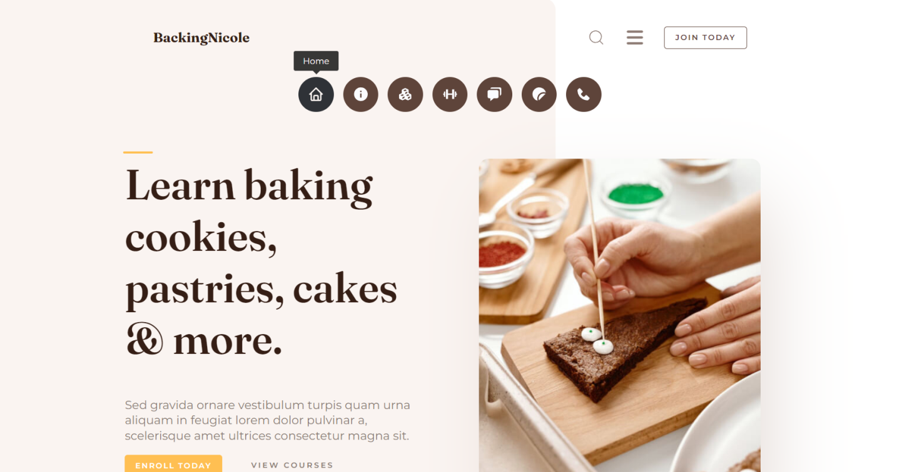

# Baking website Courses


  If you like the project, please give the project a GitHub ⭐

[Preview Website - Demo](https://baking-courses.vercel.app/)

## Tools 🪄
- React 
- JavaScript
- react-router v6
- Vite
- npm
- HTML/CSS
- Tooltip 

--- 

## Main goals of this project 📊
  **You will discover the true power and potential of React ```components and routers```. You'll gain the skills and knowledge to create dynamic and scalable applications with ease. Don't miss out on this opportunity to take your development skills to the next level🎯!**


## What you will learn? 📝
  - How do you structure your files and folders well?
  - What is the easiest way to add an active class to a navBarLink?
  - How do you use the ```.map()``` method to fetch data?
  - How can I smoothly switch between different components using ```react-router-v6```?


---


# 💎What Are React Components?


  We know that React has advantages such as being **easy to learn**, **easy to test**, and **easy to understand the code**. In just a few lines, you will know ***How React applies these features in real code cases.***

  When you start learning React, you'll notice that components are the first concept you'll encounter. This is because React wants you to learn how to structure your code correctly. to be easy to learn, test, and understand! 

  #### In this session, we will present information about the meaning of components uniquely and innovatively.

> In React, you can consider components as callback functions that you call to use in other functions.

  Components in React are similar to ```buttons, headers, footers, or navigation bars``` that you use multiple times in your project. Instead of coding them repeatedly, you can create a "components" folder and add all the elements that you require **more than once**.

  #### A question may arise in your mind about when should I create components. To understand this, let's take an example.
    Take Instagram's profile page, for example. By separating the components and optimizing them to [profile info, highlighted stories, saved, liked, reels, and profile posts.], the page becomes faster, easier to navigate, and more user-friendly.
  


## Technically, what are the benefits of using React components?
  - **Modularity**: You can create reusable components that encapsulate specific functionality and UI elements.

  - **Component-Based Architecture**: The UI is broken down into independent, isolated components that manage their state and render their UI.

  - **Virtual DOM**: React uses a virtual DOM to efficiently update and render the UI.

  - **Declarative Syntax**: React uses a declarative syntax to describe how the UI should look based on the current state.

----
  In conclusion, React components **offer a powerful way to build modular, reusable, and efficient user interfaces**. By breaking down the UI into independent components, leveraging the virtual DOM, and following a declarative approach, ***React simplifies development and maintenance while delivering high-performance web applications.*** As a front-end developer, mastering React components will empower you to create engaging and scalable user experiences. Embrace the power of React components and unlock the potential of modern web development.


----

# Understand project aspects ⚙️

## Structriong 🪜

  - Inside the ```pages``` folder, there are **7 pages** that we need to ```route``` in our project. Each folder ***contains a .jsx file and a .css styles file.**
  
  


  This image displays the seven pages available in the Navbar section of our project.

  ---

  - When we navigate to the ```components``` folder, we can find the essential components that we use ```Footer``` and ```Navbar```.

      - To improve the user experience, we should implement an ErrorPage as a new approach react-router v6 suggested. 👉 [Read More](https://reactrouter.com/en/main/route/error-element)
        ```JSX
        // ErrorPage.jsx
        import { useRouteError } from "react-router-dom";
        export default function ErrorPage() {
          const error = useRouteError();
          return <h1>{error}</h1>
        }
        ```

     - NotFound page, also known as a 404 page, can improve user experience if they become lost or encounter an error. 😰

     - Finally, the layout.jsx file is particularly useful as it allows us to run our application without having to add the Navbar and Footer to each page.

---

## Go More Deeply 🏆

Jumping to our next learning goal it was:

  ### 🌟 What is the easiest way to add an active class to a navBarLink?

React Router v6 introduces a fascinating feature called ```<NavLink />``` that makes it easy to toggle between different Navbar links. 👉 [Read More](https://reactrouter.com/en/main/components/nav-link#default-active-class)
``` JSX
// Navbar.jsx
<li className="nav-item">
    <NavLink
        className="flex-center"
        to="/"
        data-tooltip-id="my-tooltip"
        data-tooltip-content="Home"
        data-tooltip-place="top"
    ><BiHome /></NavLink>
</li>
```
```CSS
/* Navbar.css */
a:hover, .nav-item a.active{
    background: var(--lt-color-gray-700);
    color: var(--color-gray);
}
```

  ### 🌟 How do you use the ```.map()``` method to fetch data?

  - First you create an ```Array``` with all your data
    ```JSX
      // courses.jsx
      const cardData = [
        {
          image: '/src/imageSrc/',
          title: 'Cookie Decorations',
          content: 'Eu adipiscing...',
          bestSeller: true
        },
      ]
    ```
  - Now map through the data:
     ```JSX
      // courses.jsx
      const isBestSeller = (item) => {
        return item.bestSeller ? "Best Seller" : '';
      };

      return <section>
        {cardData.map((item, index) => {
          return <div key={index}>
            {isBestSeller(item) ?
              <div className="bestseller-section">
                <div className="bestseller">
                    <p>Best Seller</p>
                </div>
              </div>
              :null
            }
            
            <div>
                <h1>{item.title}</h1>
                <p>{item.content}</p>
            </div>
          </div>
        })}
      </section>
    ```


# 🌟 How can I smoothly navigate between different components using ```react-router-v6```?
### How to create a router system for navigating between pages?


##### The magic happens in the ```App.jsx``` by using React-Router v6.
  importing 4 things will create all the magic!
  ```JSX
  import {
    RouterProvider,
    createBrowserRouter,
    createRoutesFromElements,
    Route
  } from "react-router-dom"
  ```

  let's take one after another!

  > ```RouterProvider:``` is a component that serves as **the top-level provider** for the routing functionality in your React application. ***It acts as the central provider for routing functionality, allowing you to define routes and enabling navigation within your application.***
  ```JSX
  export default function App() {
    return <RouterProvider router={router} />
  }
  ```

  > ```createBrowserRouter``` is a function in React Router v6 that creates a BrowserRouter specified configuration options and return instance, which serves as the client-side router for your React application. 
  ```JSX
    const router = createBrowserRouter(createRoutesFromElements(
        <Route />
    ))
  ```

  > ```createRoutesFromElements``` is a helper that creates route objects from ```<Route>``` elements. It's useful if you prefer to create your routes as JSX instead of objects.
  ```JSX
    const router = createBrowserRouter(createRoutesFromElements(
      <Route path='/' element={<Layout />} errorElement={<ErrorPage/>}>
        <Route path="blogs" element={<Blog />} errorElement={<ErrorPage/>} />
        <Route path="join" element={<Join />} errorElement={<ErrorPage/>} />
      </Route>
    ))
  ```

  > ```Route```  is a fundamental building block of React Router, responsible for rendering the appropriate component based on the current URL.
  ```JSX
    // Navbar.jsx
      <li className="nav-item">
          <NavLink
              className="flex-center"
              to="courses" //router
              data-tooltip-id="my-tooltip"
              data-tooltip-content="Courses"
              data-tooltip-place="top"
          ><BiSolidComponent /></NavLink>
      </li>
  ```

---

  #### 🌟 React-Tooltip 
Useful easy plug-in 🔥 I used in my app you need to import 2 things to be ready to use:  

  ```JSX
    import 'react-tooltip/dist/react-tooltip.css'
    import { Tooltip } from 'react-tooltip'
  ```
  you need to fill in 2 propierties:
  ```html
  <li
    data-tooltip-id="my-tooltip"

    <!-- Fill -->
    data-tooltip-content="Courses"
    data-tooltip-place="top"
  ><li/>
  ```

  [Tooltip npm 📍](https://www.npmjs.com/package/react-tooltip)

----

#### Writing this README took a significant amount of effort and time. Please consider supporting us by giving a star ⭐ to the repository. It would mean a lot to us. Thank you for your dedication and contribution.
